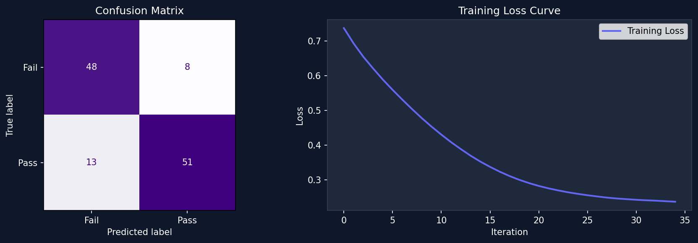

# 🎓 Student Performance Evaluator — ANN

[](https://your-app-name.streamlit.app)


> An **Artificial Neural Network** that predicts whether a student will **Pass or Fail** based on academic performance features.

---

## 🚀 Live Demo

👉 **[Open App on Streamlit Cloud](https://your-app-name.streamlit.app)**

---

## 📸 Screenshot



---

## 🧠 What This Project Does

This project trains an ANN (Multilayer Perceptron) to learn the function:

```
f(attendance, assignment, quiz, mid_term, study_hours) → Pass / Fail
```

The trained model is deployed as an interactive **Streamlit web app** where anyone can enter student data and get an instant prediction with probability.

---

## 📂 Project Structure

```
student-performance-ann/
│
├── app.py                 ← Streamlit web UI (main entry point)
├── train_ann.py           ← Training script (Tasks 1–8)
├── predict.py             ← Reusable evaluation function + CLI
├── dataset.xlsx           ← Student performance dataset (600 rows)
├── model.joblib           ← Saved trained ANN
├── scaler.joblib          ← Saved StandardScaler
├── training_report.png    ← Confusion matrix + loss curve
├── requirements.txt       ← Python dependencies
└── README.md              ← This file
```

---

## 📊 Dataset

| Column | Description | Range |
|---|---|---|
| `attendance` | % of classes attended | 0–100 |
| `assignment` | Assignment marks | 0–100 |
| `quiz` | Quiz marks | 0–100 |
| `mid` | Mid-term exam marks | 0–100 |
| `study_hours` | Weekly study hours | 0–30 |
| `result` | **Target**: 0=Fail, 1=Pass | 0 or 1 |

- **Total records:** 600
- **Pass:** 322 (53.7%) | **Fail:** 278 (46.3%)

---

## 🔧 ANN Architecture

```
Input Layer    →  5 features
Hidden Layer 1 →  64 neurons (ReLU)
Hidden Layer 2 →  32 neurons (ReLU)
Output Layer   →  1 neuron (Sigmoid) → Pass probability
```

| Metric | Value |
|---|---|
| Accuracy | **82.5%** |
| Precision | 83% |
| Recall | 82% |
| F1-Score | 82% |
| Optimizer | Adam |
| Converged in | 35 iterations |

---

## 🖥️ Run Locally

```bash
# 1. Clone the repository
git clone https://github.com/YOUR_USERNAME/student-performance-ann.git
cd student-performance-ann

# 2. Create virtual environment
python -m venv venv
venv\Scripts\activate        # Windows
# source venv/bin/activate   # macOS/Linux

# 3. Install dependencies
pip install -r requirements.txt

# 4. (Optional) Retrain the model
python train_ann.py

# 5. Run the app
streamlit run app.py
```

---

## ☁️ Deploy to Streamlit Cloud (Free)

1. **Fork** this repository to your GitHub account
2. Go to [share.streamlit.io](https://share.streamlit.io)
3. Click **"New app"**
4. Select your forked repo
5. Set **Main file path** → `app.py`
6. Click **Deploy!** 🚀

---

## 📖 Key Concepts

**Why StandardScaler?**
Features have different ranges (0–100 vs 0–30). Scaling to mean=0, std=1 ensures all features contribute equally to gradient updates.

**Why save both model.joblib AND scaler.joblib?**
The scaler stores training-time statistics. Predictions must use identical scaling or results will be wrong.

**Limitations:**
- Synthetic dataset — real patterns may differ
- Binary output only (Pass/Fail, not grade)
- 5 features only — many real-world factors excluded

---

## 📦 Tech Stack

- **Python 3.10+**
- **scikit-learn** — MLPClassifier, StandardScaler
- **Streamlit** — web UI
- **pandas / numpy** — data processing
- **matplotlib** — visualizations
- **joblib** — model serialization

---

## 👩‍💻 Author

Made with ❤️ as part of an AI/ML assignment on function approximation using ANNs.

---

## 📄 License

MIT License — free to use, modify, and distribute.
